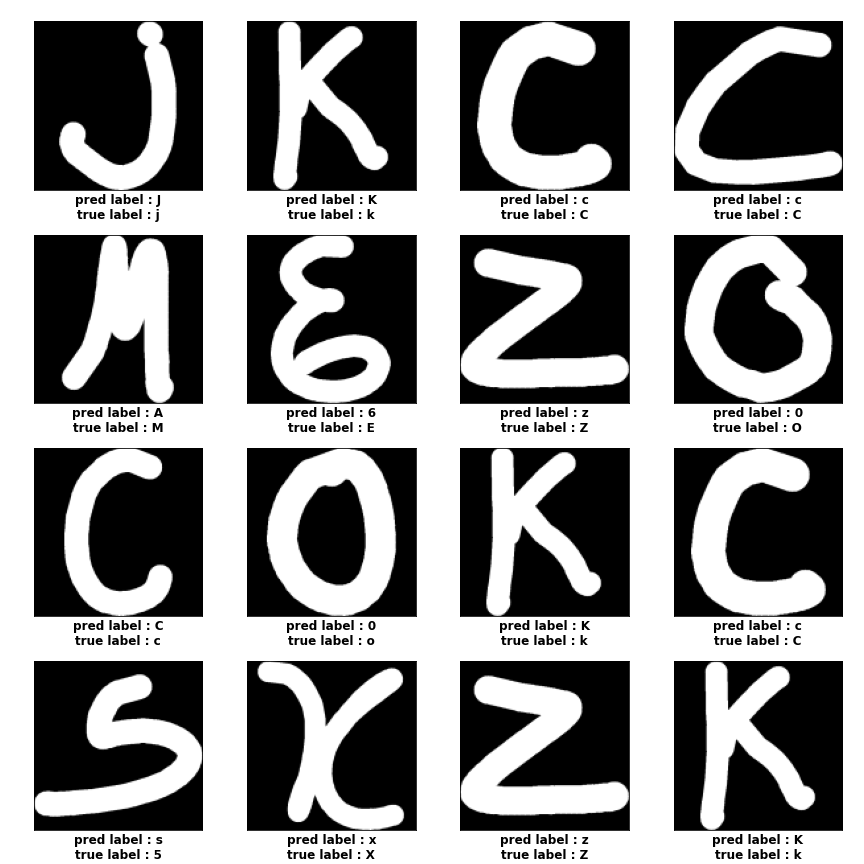
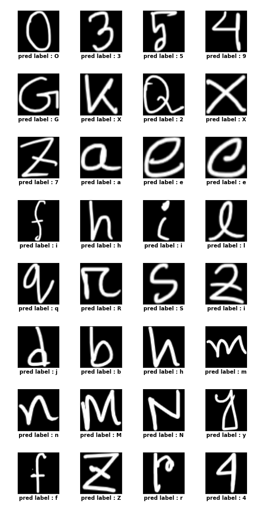

# Character-classification
A deep learning model for recognizing English letters and digits

[Used dataset](https://www.kaggle.com/dhruvildave/english-handwritten-characters-dataset)
The dataset contains 3410 image files containing handwritten digits[0 - 9] and alaphabets ['A' - 'Z', 'a' - 'z'], a total of 62 classes.
\
Among the 3410 images, 341 are used for testing and the remaining is used for training

Validation accuracy achieved : **86.51%**
\
Inspection of the incorrect predictions in the validation cases reveal some reasons of Not So High valiadation accuracy
1. The model faces difficulties in distinguishing small letters and capital letters. For example c and C, x and X, z and Z ans so on.
2. Some letters and digits are very similar looking. For example, l and 1, S and 5, and so on.
\

Incorrect predictions in validation data:

Test on images outside the dataset

The model also is not quite capable of recognizing wide range of writing style as seen from the test images outside the dataset
